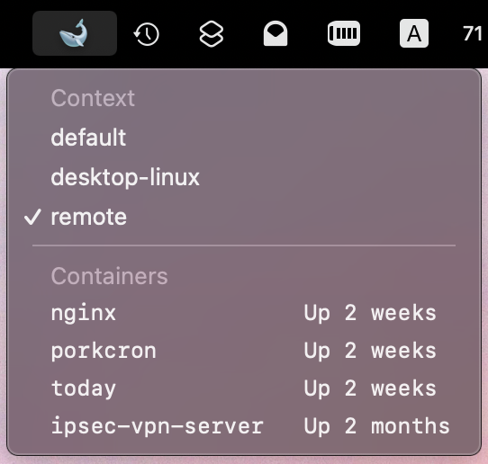
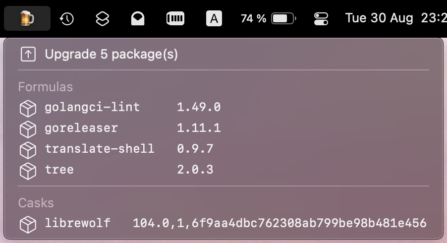
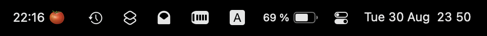

# SwiftBar plugins

[](https://github.com/junk1tm/swiftbar-plugins/actions/workflows/python.yml)

A collection of my plugins for [SwiftBar][1] (also compatible with [xbar][2]).

## 📦 Install

> Python 3.11+ is required

1. [Install SwiftBar][3] (if not already)

2. Clone this repository

```shell
git clone https://github.com/junk1tm/swiftbar-plugins.git
```

3. Create a symlink to the selected plugin in your [SwiftBar plugin folder][4]

```shell
ln -s /path/to/repo/plugin_name.py $SWIFTBAR_PLUGINS_PATH/plugin_name.py
```

## 🔌 Plugins

* [Docker containers](#docker-containers)
* [Homebrew upgrades](#homebrew-upgrades)
* [Pomodoro timer](#pomodoro-timer)

Most plugins support configuration via top-level constants, such as `PLUGIN_ICON`.
Feel free to modify them for your needs.

### Docker containers



Switch between Docker contexts and list running containers.
Click on one to open its log in a separate terminal tab.

### Homebrew upgrades



List and upgrade outdated Homebrew packages.
Works best with the [built-in autoupdate mechanism][5].

### Pomodoro timer



The [Pomodoro timer][6] in your menu bar: start it with a single click!

[1]: https://github.com/swiftbar/SwiftBar
[2]: https://github.com/matryer/xbar
[3]: https://github.com/swiftbar/SwiftBar#how-to-get-swiftbar
[4]: https://github.com/swiftbar/SwiftBar#plugin-folder
[5]: https://docs.brew.sh/Manpage#autoupdate-subcommand-interval-options
[6]: https://en.wikipedia.org/wiki/Pomodoro_Technique
